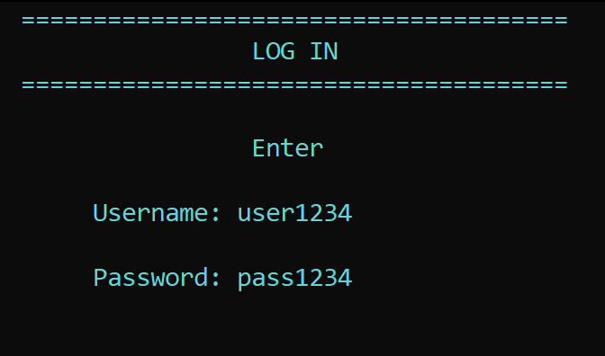
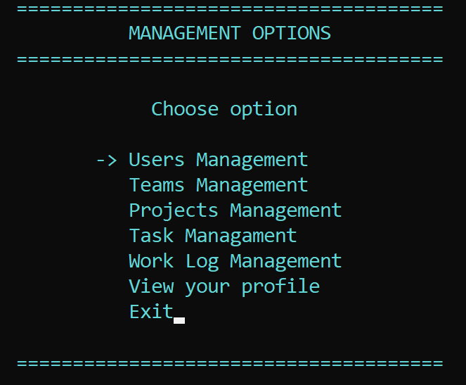

# 2122-10: On the job training (OTJ) project

## 1. Introduction

This is your personal repository for the OTJ project. **Do not create any projects until requested by your teacher!**

## 2. Project definition & links

Project's definition contains your assignment. It has its own repo and will be updated frequently to reflect every stage of the project.

You're required to follow and implement the bare minimum of functionality. You're free to extend the project and add more features.

[Assignment's README](https://github.com/codingburgas/2122-otj-10-project-definition)

**Note:** if you receive error 404, please ensure you're logged in GitHub. If you still receive 404, please contact your teacher.

## About 💻 <a name = "about"></a>
A Project Management application that would manage the operations of an IT company. It should bring visibility to an organization of multiple teams, working on multiple projects. It is a platform for project management and time tracking.

## Preview of project 🎥 <a name = "preview"></a>
<div align = "center">
   
   <br>
   
</div>

## Related documents 📄 <a name = "docs"></a>
   + [Doxygen documentation](https://github.com/TNOpanska19/OTJ-2022-doxygen-documentation)

## Usage 🖱️ <a name = "usage"></a>
The user can create or be added to different teams and projects where they can find tasks to be done. The overall concept is that the application is used for project management.

## Installation ⚙ <a name = "installation"></a>
You can download my project from [GitHub](https://github.com/codingburgas/2122-otj-10-project-repo-TNOpanska19) by pressing the **green clone button**

OR

Pasting this line of code in **your favourite Terminal**:

```
git clone https://github.com/codingburgas/2122-otj-10-project-repo-TNOpanska19.git
```

```
Thank you for scrolling this far!
```
